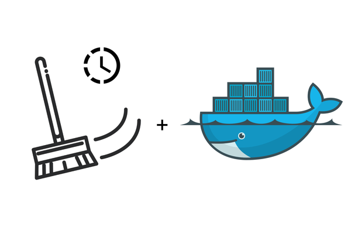

# Clear Images


[](https://github.com/mohammadasiyabani/clear-images/blob/master/LICENSE)
[](https://github.com//mohammadasiyabani/clear-images)
[](https://github.com/mohammadasiyabani/clear-images)
[](https://github.com/mohammadasiyabani/clear-images/issues)
<p align="center">
 
</p>
<p align="center">Created by <a href="https://github.com/mohammadasiyabani">Mohammad Sajjad Asiyabani</a>.</p>


***
# What is Dangling images in docker ?
A dangling image is one that is not tagged and is not referenced by any container.

# How Dangling images borning in docker ?
Some times you have an image on your system and a newer version of that image comes and you pull it from the registry.when you pull a newer image from registry , the oldest image tag changed to none.
Or sometimes you working on an image and you build it with a static name and tag the oldest one name and tag changed to the none and the latest image built with static name. 
it depends on how many times you do that ,For each execution of the build command, a none tag image will be added to your image list 

# What does this script do?
when you run this script it will find all your dangling images and list them, it shows you that list and starts to remove all dangling images that exist on your system

***
# How to use ?
## 1) local :
you can use this script locally, for this solution you need to clone this project on your system
```bash
git clone https://github.com/mohammadasiyabani/clear-images.git
```
then go to the project path 
```bash
cd clear-images
```
now you can run this script with superuser permission
```bash
sudo ./clear-image
```
## 2) Global :
If you want to use this script in any path, you must install this script globally .
to install this script globally you need to run just the following commands.
* Clone this project on your system
```bash
git clone https://github.com/mohammadasiyabani/clear-images.git
```
* Go to the project path
```bash
cd clear-images
```
* Install this script on your system by following command
```bash
sudo install clear-images /usr/bin/clear-images 
```
* Now you can run this script in any path by this command
```bash
sudo clear-images
```